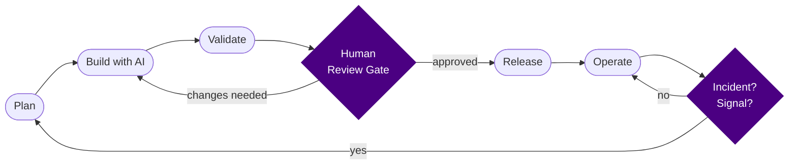

# AI Delivery Engineering

**A public reference for shipping software reliably with AI-assisted workflows — validated, reviewed, and production-ready.**

---

How do you ship software with AI assistance without losing quality, safety, or accountability? You treat AI as an accelerant — for drafting, implementing, and surfacing options — and you keep humans in the loop for architecture, validation, decision-making, and final approval. This repository documents the methodology, templates, checklists, and worked examples that make that loop repeatable.

This is the working reference for an AI Delivery Engineer who ships real things: features, fixes, refactors, and releases — with structured evidence that the work is sound.

---

## What this is

A structured, operable knowledge base covering:

- **Methodology** — how AI-assisted delivery actually works, from first commit to production
- **Templates** — ready-to-fill documents for decisions, test plans, release plans, postmortems, and more
- **Checklists** — gate criteria for pre-merge, release readiness, security review, and production readiness
- **Examples** — concrete walkthroughs of a feature delivery, bugfix, and refactor using the Beacon and Atlas synthetic systems
- **GitHub scaffolding** — PR templates, issue templates, and CI workflow configuration

Everything here reflects the judgment layer that AI cannot replace: knowing when a diff is safe, when a test plan is complete, and when a system is ready to ship.

---

## Who it is for

| Audience | What they will find here |
|---|---|
| Engineering managers evaluating AI delivery practices | A structured, opinionated methodology with clear human accountability at every gate |
| Founders building AI-native engineering teams | Concrete patterns for integrating AI tools without degrading quality or safety |
| AI-forward companies (Anthropic, Cursor, Cognition, Scale AI, etc.) | Evidence of systematic thinking, shipping discipline, and engineering credibility |
| Individual engineers adopting AI tools | Reusable templates and checklists they can apply today |

---

## The methodology at a glance

AI accelerates each phase. Humans own every gate.

**Plan** — define the problem, write a design doc or ADR, identify risks before touching code.

**Build with AI** — use AI tools (Claude Code, Cursor, Copilot) for drafting, implementing, and exploring options. The engineer steers; AI executes.

**Validate** — run tests, check types, lint, review coverage, and verify the change against the test plan.

**Human Review Gate** — a human reads the diff, checks the checklist, and either approves or sends it back. This gate cannot be skipped or automated away.

**Release** — follow the release plan, verify in staging, confirm rollback is possible, then ship.

**Operate** — monitor, alert, and respond. Signals from production feed back into planning.

Full detail: [docs/delivery-lifecycle.md](docs/delivery-lifecycle.md) and [docs/ai-assisted-workflow.md](docs/ai-assisted-workflow.md).

---

## Repository map

| Area | What it contains | Key files |
|---|---|---|
| [`docs/`](docs/) | Methodology, principles, and process documentation | [methodology-overview.md](docs/methodology-overview.md) · [principles.md](docs/principles.md) · [human-in-the-loop.md](docs/human-in-the-loop.md) · [validation-framework.md](docs/validation-framework.md) |
| [`templates/`](templates/) | Blank, ready-to-fill documents for every delivery artifact | [architecture-decision-record.md](templates/architecture-decision-record.md) · [test-plan.md](templates/test-plan.md) · [release-plan.md](templates/release-plan.md) · [incident-postmortem.md](templates/incident-postmortem.md) |
| [`checklists/`](checklists/) | Gate criteria used at key delivery checkpoints | [pre-merge.md](checklists/pre-merge.md) · [release-readiness.md](checklists/release-readiness.md) · [ai-code-review.md](checklists/ai-code-review.md) · [production-readiness.md](checklists/production-readiness.md) |
| [`examples/`](examples/) | Full walkthroughs of real delivery scenarios using synthetic systems | [feature-delivery-walkthrough.md](examples/feature-delivery-walkthrough.md) · [bugfix-walkthrough.md](examples/bugfix-walkthrough.md) · [ai-assisted-refactor.md](examples/ai-assisted-refactor.md) |
| [`.github/`](.github/) | PR template, issue templates, CI workflow | [PULL_REQUEST_TEMPLATE.md](.github/PULL_REQUEST_TEMPLATE.md) · [ci.yml](.github/workflows/ci.yml) |

The [`docs/README.md`](docs/README.md), [`templates/README.md`](templates/README.md), [`checklists/README.md`](checklists/README.md), and [`examples/README.md`](examples/README.md) each provide a short index to their section.

---

## How to use this repo

### As an individual engineer

1. **Start with the methodology.** Read [docs/methodology-overview.md](docs/methodology-overview.md) to understand the full delivery loop and where AI fits.
2. **Copy a template.** When starting a new feature or fix, copy the relevant template from [`templates/`](templates/) into your own repo or document system.
3. **Run the checklists.** Before opening a PR or cutting a release, work through the relevant checklist in [`checklists/`](checklists/).
4. **Read an example.** The walkthroughs in [`examples/`](examples/) show how the templates and checklists connect to real delivery work.

### As a team

1. **Adopt the delivery lifecycle.** Use [docs/delivery-lifecycle.md](docs/delivery-lifecycle.md) as a starting point for your own process definition.
2. **Fork the templates.** Adapt the documents in [`templates/`](templates/) to your stack and conventions.
3. **Embed the checklists.** Add the checklists from [`checklists/`](checklists/) to your PR and release workflows — either as GitHub PR template sections or as references in runbooks.
4. **Log AI usage.** Use [templates/ai-change-log.md](templates/ai-change-log.md) to create a lightweight record of where AI generated or significantly shaped each change.

---

## AI usage policy

**AI-assisted. Human-reviewed. Human-approved.**

AI tools (Claude Code, Cursor, GitHub Copilot) generate, draft, and accelerate work in this repository. Every output — code, documentation, checklist, template — was reviewed, validated, and approved by a human engineer before it was committed. AI suggests; humans decide.

This means:

- AI did not choose the architecture, the process design, or the validation criteria.
- A human read every diff and confirmed it was correct and complete before merging.
- Where AI output was used substantially, it is noted in the commit history or AI change log.
- Accountability for what ships belongs entirely to the engineer, not the model.

See [docs/ai-assisted-workflow.md](docs/ai-assisted-workflow.md) and [docs/human-in-the-loop.md](docs/human-in-the-loop.md) for the full treatment.

---

## About Ramen Protocol

Ramen Protocol is a public engineering identity for AI-assisted software delivery work. The goal is to build credible, operable, open evidence of what a serious AI Delivery Engineer actually does — not a portfolio of demos, but a body of work that reflects real engineering discipline: validation, structure, accountability, and shipped systems.

Questions, feedback, or collaboration: open an issue on this repository or reach out via [GitHub](https://github.com/ramenprotokol).

---

## License

[MIT](LICENSE). Use it, adapt it, build on it.
