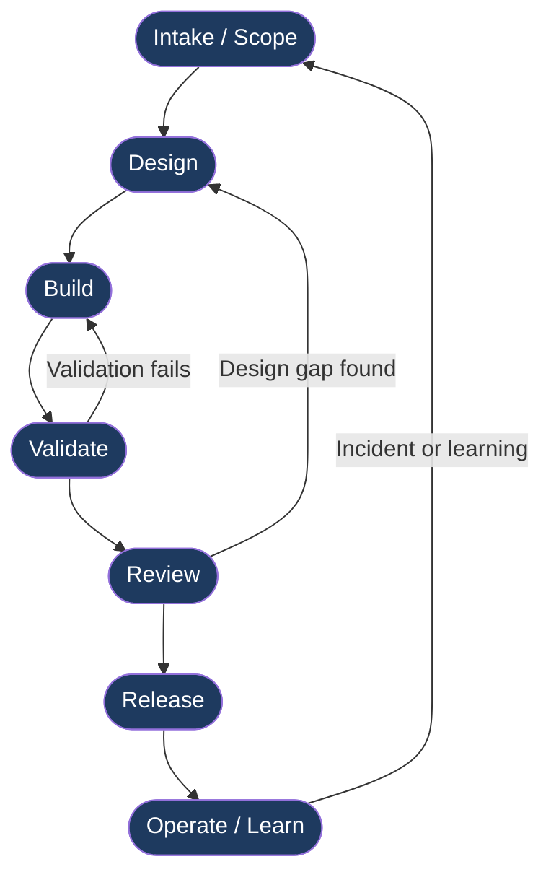

# Delivery Lifecycle

Every change shipped through this system moves through seven stages. The stages are linear by default, but a change can loop back — a failed validation returns to Build; a review that surfaces a design gap returns to Design. The loop is deliberate, not a failure.

These seven stages are the detailed expansion of the six-stage core loop in [methodology-overview.md](methodology-overview.md) — the loop's single Plan stage is broken out here into Intake/Scope and Design.

This document describes each stage: what goes in, what happens, where AI helps, what the human gate is, and what comes out.

---

## Lifecycle Flow

---

## Stage 1 — Intake / Scope

**What goes in:** a request, a bug report, an incident finding, or a product requirement.

**Activities:**

- Understand the problem, not just the ask
- Establish acceptance criteria before any design starts
- Identify unknowns, constraints, and dependencies
- Assign a severity and rough size estimate
- Open a tracking issue

**AI assistance:**

- Drafting a problem statement from a rough description
- Surfacing related issues or prior incidents from search
- Suggesting acceptance criteria given a feature description (reviewed and edited by the delivery engineer — never accepted verbatim)

**Human gate:** The delivery engineer confirms the problem statement and acceptance criteria are correct before work proceeds. Without this gate, teams build the wrong thing precisely.

**Outputs / artifacts:**

- Tracking issue with clear problem statement and acceptance criteria
- Scope decision (in / out of scope items explicitly named)

**Running example:** A stakeholder reports that Beacon's `/notify` endpoint returns HTTP 200 for some requests that never actually queue. The intake gate confirms: the acceptance criterion is "a 200 response means the message was durably enqueued — no silent drops."

---

## Stage 2 — Design

**What goes in:** confirmed problem statement and acceptance criteria from Stage 1.

**Activities:**

- Identify affected systems and components
- Evaluate options; document the reasoning, not just the decision
- Write an Architecture Decision Record (ADR) for any change that affects system contracts, data shape, or operational behavior
- Write a Design Doc for changes above a defined complexity threshold
- Identify security, performance, and rollback considerations

**AI assistance:**

- Generating an ADR or Design Doc skeleton from the problem statement
- Suggesting alternative approaches the engineer may not have considered
- Identifying edge cases and failure modes from the proposed design
- Drafting sequence diagrams and data flow descriptions

**Human gate:** The delivery engineer (and a second reviewer for significant changes) approves the design before implementation starts. AI-generated designs are starting points — the human is accountable for the architecture decision.

**Outputs / artifacts:**

- [Architecture Decision Record](../templates/architecture-decision-record.md) (if applicable)
- [Design Doc](../templates/design-doc.md) (if applicable)
- [Risk Assessment](../templates/risk-assessment.md)
- Updated tracking issue with design link

**Running example:** The Beacon silent-drop fix requires changing how the queue write is confirmed before returning 200. The ADR documents three options (synchronous write confirmation, async with idempotency key, circuit breaker pattern) and records why synchronous write confirmation was chosen given the latency budget.

---

## Stage 3 — Build

**What goes in:** approved design and acceptance criteria.

**Activities:**

- Write code, tests, migrations, configuration changes
- Keep commits scoped — one logical change per commit
- Log every significant AI-generated block in the AI change log
- Run linting and unit tests locally before opening a pull request
- Write or update runbook entries for any operational change

**AI assistance:**

- Generating implementation code from a scoped, well-specified prompt
- Suggesting test cases for a given function or API contract
- Writing migration scripts and rollback procedures
- Drafting inline documentation and commit messages

**Guardrails during Build:**

- AI-generated code is never merged without human review
- Every AI-generated block is tagged in the [AI Change Log](../templates/ai-change-log.md)
- If the AI-generated code calls an API or uses a library method, the delivery engineer verifies it against the actual docs — not the AI's description of the docs

**Human gate:** The delivery engineer owns every line merged, regardless of whether AI wrote it. Opening a pull request is the gate: the engineer has read the diff, the tests pass, and the AI change log is current.

**Outputs / artifacts:**

- Pull request with passing CI
- [AI Change Log](../templates/ai-change-log.md) entries
- Updated or new [Runbook](../templates/runbook.md) sections
- Test coverage for acceptance criteria

**Running example:** Claude Code generates the updated queue-write handler for Beacon. The delivery engineer reads the diff, verifies the queue client's `putMessage` method signature against the actual SDK docs (the AI had described an outdated signature), corrects it, and logs the correction in the AI change log.

---

## Stage 4 — Validate

**What goes in:** pull request and test suite from Stage 3.

**Activities:**

- Run the full test suite (unit, integration, contract)
- Execute the [test plan](../templates/test-plan.md) for the change
- Verify acceptance criteria are met, not just that tests pass
- Run security checks (dependency scan, static analysis)
- Validate rollback procedure works

**AI assistance:**

- Generating additional edge-case test scenarios given the acceptance criteria
- Reviewing the test plan for coverage gaps
- Summarizing test output and flagging anomalies

**Human gate:** The delivery engineer confirms all acceptance criteria are met and no regressions are introduced. A test suite that passes but doesn't cover the acceptance criterion is a failed validation, not a passing one.

**Outputs / artifacts:**

- Completed [Test Plan](../templates/test-plan.md)
- Test run records
- Security scan results
- Rollback validation record

**Running example:** The Beacon test suite passes. But the delivery engineer checks: is there a test that specifically validates that a queue write failure returns 5xx (not 200)? There isn't. That test is written and added before the PR advances to Review.

---

## Stage 5 — Review

**What goes in:** validated pull request with passing tests and completed test plan.

**Activities:**

- Peer code review using the [AI code review checklist](../checklists/ai-code-review.md)
- Check that the AI change log entries are accurate
- Verify the design decision is reflected correctly in the implementation
- Check for security issues, operational concerns, missing documentation
- Approve or request changes

**AI assistance:**

- AI-assisted review to surface potential issues (logged in the AI change log)
- Generating a review summary for large diffs
- Cross-checking implementation against the design doc

**Human gate:** A human reviewer (not the author) approves the pull request. The approval is a statement: "I have read this diff, I understand what it does, and I am confident it is safe to merge." AI-assisted review is a tool for the reviewer, not a substitute for the reviewer's judgment.

**Outputs / artifacts:**

- Approved pull request
- Review comments and resolutions
- Sign-off record

**Running example:** A second engineer reviews the Beacon fix. They use the AI code review checklist and flag that the timeout on the synchronous queue write has no upper bound. The delivery engineer adds a configurable timeout with a safe default. The reviewer re-approves.

---

## Stage 6 — Release

**What goes in:** approved, merged pull request.

**Activities:**

- Execute the [Release Plan](../templates/release-plan.md)
- Complete the [Release Readiness checklist](../checklists/release-readiness.md)
- Deploy using the defined procedure (feature flags, staged rollout, blue/green — whatever the release plan specifies)
- Confirm post-deploy health checks pass
- Notify stakeholders

**AI assistance:**

- Drafting the release plan from the change description
- Generating a stakeholder communication summary
- Suggesting rollback triggers (metric thresholds, error rate spikes)

**Human gate:** The approver (delivery engineer or on-call lead) makes the go/no-go decision. This is not delegated to AI. The approver owns the decision to ship.

**Outputs / artifacts:**

- Completed [Release Plan](../templates/release-plan.md)
- Deploy record with timestamp and actor
- Post-deploy health check results
- Stakeholder notification

**Running example:** Beacon's fix is deployed to 5% of traffic via feature flag. The delivery engineer monitors the queue success rate and error rate for 30 minutes. Both are nominal. The flag is fully enabled. The deploy record names the delivery engineer as the approver.

---

## Stage 7 — Operate / Learn

**What goes in:** running production system; incident reports; user feedback; monitoring data.

**Activities:**

- Monitor for regressions or new failures
- Run scheduled post-deploy reviews (24h, 72h checkpoints)
- Write a postmortem for any incident, regardless of severity
- Feed learnings back into Stage 1 as new intake items

**AI assistance:**

- Summarizing log patterns and anomalies
- Drafting postmortem timelines from incident data
- Suggesting process improvements based on the postmortem

**Human gate:** The on-call engineer owns incident response. Postmortem sign-off requires a named human reviewer. Process changes from learnings go back through the full lifecycle from Stage 1.

**Outputs / artifacts:**

- [Incident Postmortem](../templates/incident-postmortem.md) (for any incident)
- Updated runbook if the incident revealed a gap
- New intake items for follow-on work

**Running example:** Two days after the Beacon fix, monitoring shows a spike in queue write timeouts at a specific traffic pattern. The on-call engineer files an incident, and the postmortem produces a new intake item: tune the timeout default and add an alert for queue write p99 latency.

---

## Summary Table

| Stage | Human Gate | Primary Artifact |
|---|---|---|
| 1 — Intake / Scope | Delivery engineer confirms problem statement and acceptance criteria | Tracking issue |
| 2 — Design | Delivery engineer (+ reviewer) approves design | [ADR](../templates/architecture-decision-record.md) / [Design Doc](../templates/design-doc.md) |
| 3 — Build | Delivery engineer owns the diff before opening PR | PR + [AI Change Log](../templates/ai-change-log.md) |
| 4 — Validate | Delivery engineer confirms all acceptance criteria are met | [Test Plan](../templates/test-plan.md) |
| 5 — Review | Human reviewer approves the pull request | Approved PR |
| 6 — Release | Approver makes go/no-go decision | [Release Plan](../templates/release-plan.md) |
| 7 — Operate / Learn | On-call engineer owns incidents; reviewer signs off postmortems | [Postmortem](../templates/incident-postmortem.md) |

---

## Related

- [AI-Assisted Workflow](ai-assisted-workflow.md) — how AI is used at each stage in practice
- [Human-in-the-Loop](human-in-the-loop.md) — the accountability and review model
- [Validation Framework](validation-framework.md) — how validation works across the lifecycle
- [Templates](../templates/README.md) — all templates referenced above
- [Checklists](../checklists/README.md) — all checklists referenced above
