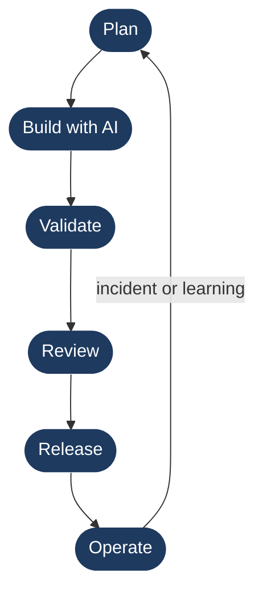

# Methodology Overview

AI Delivery Engineering is a structured way of working where AI tools accelerate execution and humans retain ownership of architecture, judgment, validation, and accountability. This document describes the operating model: the core loop, the decision gates a human must clear at each stage, and the three pillars that define the approach.

---

## The Core Loop

Every unit of work — a feature, a bugfix, a refactor, an infrastructure change — moves through six stages. AI assists at every stage. A human approves every gate.

### Stage 1 — Plan

The delivery engineer defines the problem, the acceptance criteria, and the constraints before any code is written. AI can assist with research, option generation, and draft ADRs, but the engineer owns the architecture decision.

**Human gate:** The delivery engineer approves the plan and the approach before Build begins.

### Stage 2 — Build with AI

The engineer works with AI tools (Claude Code, Cursor, GitHub Copilot) to generate code, tests, configuration, and documentation. AI output is treated as a draft, not a deliverable — it is read, understood, and verified by the engineer before it enters the codebase.

**Human gate:** The engineer reviews, edits, and commits each piece of AI-generated work. Nothing is committed without being read.

### Stage 3 — Validate

The engineer runs the validation suite: automated tests, type checks, linters, contract tests, and manual spot-checks against the acceptance criteria defined in Stage 1. AI-generated code is held to the same standard as human-written code — it must pass, not just run.

**Human gate:** The engineer confirms that validation results match the evidence required by the [validation framework](validation-framework.md). Failing evidence blocks the next stage.

### Stage 4 — Review

A second person (a peer, a lead, an approver) reviews the diff, the test evidence, and the change rationale. The reviewer checks for correctness, risk, reversibility, and completeness — not just style.

**Human gate:** The approver explicitly signs off. Approval is not implicit in merge — it requires a deliberate decision.

### Stage 5 — Release

The change is deployed through a defined release process: staged rollout, feature flag, or direct deploy depending on risk level. A rollback plan exists before deployment begins. Monitoring is in place before traffic hits the change.

**Human gate:** The on-call engineer or release approver confirms deployment health before the rollout completes or widens.

### Stage 6 — Operate

The system is observed in production. Alerts, dashboards, and error rates are checked against the baseline established before release. Incidents trigger postmortems. Learnings feed back into the next planning stage.

**Human gate:** On-call owns the response to any alert. No automated system closes an incident without human confirmation that the system is healthy.

---

## The Three Pillars

### AI-Assisted

AI tools are used throughout the loop — for drafting code, generating test cases, writing documentation, reviewing diffs, and researching options. The goal is to move faster without cutting corners. AI handles the mechanical and the repetitive; humans handle the consequential.

### Human-Reviewed

Every AI output is reviewed by a human before it becomes part of the deliverable. "Review" means reading and understanding, not scanning. A human who cannot explain what a piece of code does has not reviewed it.

### Human-Approved

Every gate in the loop requires an explicit human approval: the plan, the commit, the validation result, the review, the release, the incident close. Approval is a real decision, not a checkbox. The approver is accountable for what they approve.

---

## What Changes When AI Enters the Workflow

| Area | Without AI | With AI |
|---|---|---|
| Code generation speed | Hours to days | Minutes to hours |
| First-draft quality | Varies by engineer | Consistently high starting point |
| Test coverage breadth | Depends on discipline | AI suggests cases the engineer might miss |
| Documentation currency | Often lags the code | Easier to keep up to date |
| Review load | All original | Reviewer reads AI-generated diffs too |

## What Does NOT Change

- The engineer is accountable for what ships.
- The reviewer is accountable for what they approve.
- Failing tests block a release regardless of who wrote the code.
- A change without a rollback plan does not go to production.
- A postmortem is required after every incident.
- Architecture decisions are documented in ADRs with the reasoning, not just the choice.

AI does not change the accountability model. It changes the speed at which work reaches the gates — which means the gates matter more, not less.

---

## Related Documents

- [Delivery Lifecycle](delivery-lifecycle.md) — full stage-by-stage breakdown with artifacts and owners
- [AI-Assisted Workflow](ai-assisted-workflow.md) — which tools are used and how AI output is handled
- [Human-in-the-Loop](human-in-the-loop.md) — non-negotiable human decision points
- [Validation Framework](validation-framework.md) — evidence requirements and pass/fail criteria
- [Release Readiness](release-readiness.md) — what a change must prove before it ships
- [Principles](principles.md) — the engineering values underlying this model
