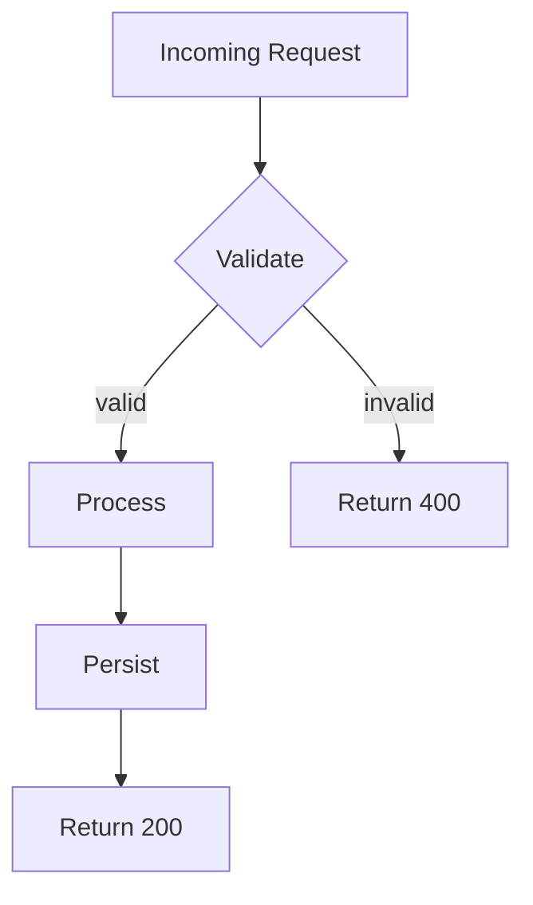

# Design Doc: [Feature or System Name]

<!-- Title should match the change being proposed. Example: "Beacon: Idempotent Retry Handling for Webhook Delivery" -->

| Field | Value |
|---|---|
| **Status** | <!-- Draft / In Review / Approved / Superseded --> |
| **Author(s)** | <!-- Roles only — e.g. "delivery engineer, platform lead" --> |
| **Reviewers** | <!-- Roles of people asked to review --> |
| **Created** | <!-- YYYY-MM-DD --> |
| **Last Updated** | <!-- YYYY-MM-DD --> |
| **AI Assistance** | <!-- Which sections AI drafted, which tools, and what human review produced. Example: "Claude Code drafted Proposed Design and Alternatives; delivery engineer restructured and validated against system constraints." --> |
| **Approved By** | <!-- Role and date of final human approval --> |

---

## Summary

<!-- 2–4 sentences. What is being built or changed, and why? A reader who skips everything else should understand the scope from this paragraph. -->

## Problem

<!-- What is broken, missing, or going to break? Be specific. Quantify where possible — "retries are currently unbounded, causing downstream systems to receive duplicate events at a measured rate of ~3% during traffic spikes" is better than "retries are a problem." -->

## Goals

<!-- Bulleted list of outcomes this design must achieve. Write each goal in a way that can be verified — "reduce duplicate webhook deliveries to <0.1%" rather than "improve reliability." -->

-
-
-

## Non-Goals

<!-- Explicit scope boundaries. What is intentionally out of scope for this change, and why? This prevents scope creep and reviewer confusion. -->

-
-

## Proposed Design

<!-- The heart of the document. Describe the solution clearly enough that a second engineer could implement it from this description alone. Use subsections, diagrams, and code samples where they help. -->

### Overview

<!-- One paragraph or diagram capturing the high-level approach. A mermaid diagram works well here. -->



### Detailed Design

<!-- Walk through the design component by component. For each component: what it does, how it interacts with others, and any implementation details that matter for correctness. -->

#### Component / Layer 1

<!-- Description -->

#### Component / Layer 2

<!-- Description -->

### Data Model Changes

<!-- Describe any new tables, fields, indices, or schema migrations. If none, write "None." -->

| Entity | Change | Reason |
|---|---|---|
| <!-- table/object name --> | <!-- added / modified / removed field --> | <!-- why --> |

### API Changes

<!-- Describe any new endpoints, modified contracts, or removed endpoints. Include request/response shapes for new or changed endpoints. If none, write "None." -->

```text
<!-- Example: -->
POST /v1/deliveries
Request:  { "recipient_id": string, "payload": object, "idempotency_key": string }
Response: { "delivery_id": string, "status": "queued" }
```

## Alternatives Considered

<!-- At least two alternatives evaluated. For each: what it is, why it was not chosen. This section shows the decision was deliberate, not the first idea that came to mind. -->

### Alternative 1: [Name]

**Approach:** <!-- One sentence. -->

**Why not chosen:** <!-- Specific reason — cost, complexity, operational burden, etc. -->

### Alternative 2: [Name]

**Approach:** <!-- One sentence. -->

**Why not chosen:** <!-- Specific reason. -->

## Testing Plan

<!-- How will this change be verified before and after shipping? Reference the full test plan if one exists. -->

| Layer | Approach | Pass Criterion |
|---|---|---|
| Unit | <!-- what is unit tested --> | <!-- what green looks like --> |
| Integration | <!-- what is integration tested --> | <!-- what green looks like --> |
| End-to-End | <!-- scenario covered --> | <!-- what green looks like --> |
| Manual / Exploratory | <!-- what a human will verify --> | <!-- what green looks like --> |

See also: [Test Plan template](test-plan.md)

## Rollout & Rollback

<!-- How does this change reach production? What is the path if something goes wrong? -->

**Rollout strategy:** <!-- Example: feature flag gating, staged rollout to 5% → 25% → 100% over 3 days -->

**Rollback plan:** <!-- Example: disable feature flag; no migration reversal required because schema change is additive -->

**Deployment dependencies:** <!-- Anything that must happen before or alongside the deployment -->

## Risks

<!-- Known risks and how they are mitigated. Do not skip this section — an empty risk section signals that risks were not considered. -->

| Risk | Likelihood | Impact | Mitigation |
|---|---|---|---|
| <!-- Risk description --> | Low / Med / High | Low / Med / High | <!-- How it is addressed --> |

## Open Questions

<!-- Questions that are not yet resolved at the time this doc is written. Assign an owner and target resolution date for each. Update or remove questions as they are answered. -->

| Question | Owner (role) | Target Date | Resolution |
|---|---|---|---|
| <!-- Question --> | <!-- role --> | <!-- date --> | <!-- answer, or "open" --> |

## Approvals

| Role | Decision | Date |
|---|---|---|
| <!-- Reviewer role --> | Approved / Approved with changes / Rejected | <!-- YYYY-MM-DD --> |
| <!-- Reviewer role --> | Approved / Approved with changes / Rejected | <!-- YYYY-MM-DD --> |

---

*Related: [ADR index](architecture-decision-record.md) · [Release Plan template](release-plan.md) · [Test Plan template](test-plan.md) · [Delivery Lifecycle](../docs/delivery-lifecycle.md)*
